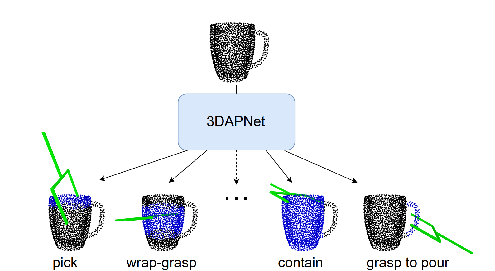
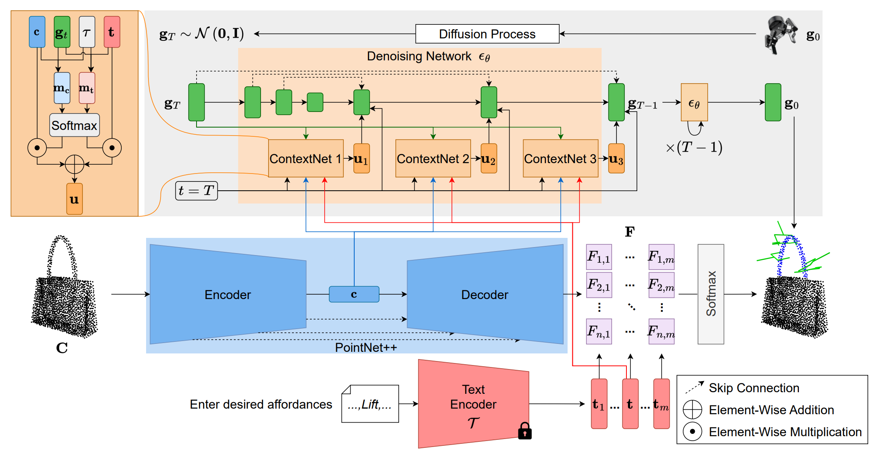
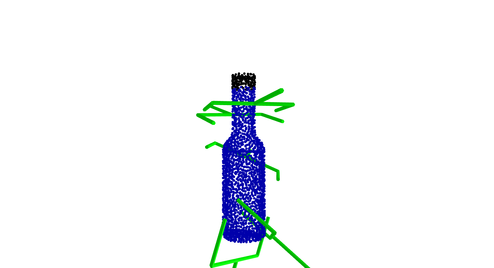

# 文件内容说明

## 目录结构

train 训练脚本：
- `my_train.py`: 核心训练脚本

eval 评估脚本：
- `my_eval_any_for_vis.py`: eval 的脚本之一，输入任一点云即可
- `my_eval_for_vis.py`: eval 的脚本之一，评估数据集中数据的结果
- `my_eval_multi_costs.py`: eval 的脚本之一，约束下的数据集数据评估结果

IsaacGym 评估脚本：
- `my_isaacgym_eval.py`: IsaacGym 评估脚本，评估任一特定格式下的待评估 npy 文件
- `my_isaacgym_eval_cong_dataset.py`: IsaacGym 针对 CONG 数据集的评估脚本，里面包含多处注释、修改用于生成不同需求的评估结果。
    - 例如评估 CONG 所有 instances 随机抽取的 10 个抓取以帮助 obtain_graspldm_dataset 去选择有效的 instances。或是评估 CONG 每个类别随机抽取一个 instance 进行评估，然后 obtain_graspldm_dataset 去选择有效的 cats 里的 instances。
    - 除了上述的评估外，还有一些用于数据处理的函数。
- `my_isaacgym_eval_results.sh`: `my_isaacgym_eval_cong_dataset.py` 评估经常会中断，因此我们写了这个脚本来循环保证生成结果

基于 CONG 去生成与 graspldm 保持一致的训练、测试数据集：下面多个文件是相同性质的，只是选择 instances 的方式不同，目前最有效的是每个 instances 抽取 10 个抓取评估，根据这个抽样的结果选择有效的 instances。
- `obtain_graspldm_dataset_sample_eval_instances.py`: 针对 CONG 所有 instances 随机抽取 10 个抓取，然后根据这个抽样的结果选择有效的 instances。然后根据有效的 instances 去选择训练、测试数据集。
- `obtain_graspldm_dataset_new_export_all_others.py`: 根据 `obtain_graspldm_dataset_sample_eval_instances.py` 选择的有效的 instances，将除了训练集外的所有有效 instances 作为测试集，这样能够挑选出结果好的。

其他脚本：
- `my_process_local_geo_dataset.py`: 缓存数据集的 local geo 数据，加快训练速度
- `my_vis_cong_dataset.py`: 可视化一下 CONG 数据集，验证数据集格式
- `my_vis_oakink_data.py`: 可视化一下 Oakink 数据集，验证数据集格式


# Bugs
### pyrender bug

```bash
sudo apt-get install -y python3-opengl
sudo apt-get install -y libosmesa6
```

- https://blog.csdn.net/qq_44354520/article/details/129345590
- https://blog.csdn.net/weixin_40437821/article/details/115200555
- https://blog.csdn.net/CCCDeric/article/details/129292944
- https://blog.csdn.net/guntangsanjing/article/details/127651381

- https://github.com/huggingface/deep-rl-class/issues/275

# [ICRA 2024] Language-Conditioned Affordance-Pose Detection in 3D Point Clouds

Official code for the ICRA 2024 paper "Language-Conditioned Affordance-Pose Detection in 3D Point Clouds". Our paper is currently available at [this arXiv](https://arxiv.org/pdf/2309.10911.pdf).



We address the task of language-driven affordance-pose detection in 3D point clouds. Our method simultaneously detect open-vocabulary affordances and
generate affordance-specific 6-DoF poses.


We present 3DAPNet, a new method for affordance-pose joint learning. Given the captured 3D point cloud of an object and a set of affordance labels conveyed through natural language texts, our objective is to jointly produce both the relevant affordance regions and the appropriate pose configurations that facilitate the affordances.


## Getting Started
We strongly encourage you to create a separate conda environment.
```
conda create -n affpose python=3.8
conda activate affpose
conda install pip
pip install -r requirements.txt
```

## Dataset
Our 3DAP dataset is available at [this drive folder](https://drive.google.com/drive/folders/1vDGHs3QZmmF2rGluGlqBIyCp8sPR4Yws?usp=sharing).

## Training
Current framework supports training on a single GPU. Followings are the steps for training our method with configuration file ```config/detectiondiffusion.py```.

* In ```config/detectiondiffusion.py```, change the value of ```data_dir``` to your downloaded data folder.
* Change other hyperparameters if needed.
* Assume you use the GPU 0, then run the following command to start training:

		CUDA_VISIBLE_DEVICES=0 python3 train.py --config ./config/detectiondiffusion.py

## Open-Vocabulary Testing
Executing the following command for testing of your trained model:

                CUDA_VISIBLE_DEVICES=0 python3 detect.py --config <your configuration file> --checkpoint <your  trained model checkpoint> --test_data <test data in the 3DAP dataset>

Note that we current generate 2000 poses for each affordance-object pair.
The guidance scale is currently set to 0.5. Feel free to change these hyperparameters according to your preference.

The result will be saved to a ```result.pkl``` file.

## Visualization
To visuaize the result of affordance detection and pose estimation, execute the following script:

                python3 visualize.py --result_file <your result pickle file>

Example of visualization:



## Citation

If you find our work useful for your research, please cite:
```
@inproceedings{Nguyen2024language,
      title={Language-Conditioned Affordance-Pose Detection in 3D Point Clouds},
      author={Nguyen, Toan and Vu, Minh Nhat and Huang, Baoru and Van Vo, Tuan and Truong, Vy and Le, Ngan and Vo, Thieu and Le, Bac and Nguyen, Anh},
      booktitle = ICRA,
      year      = {2024}
  }
```
Thank you very much.